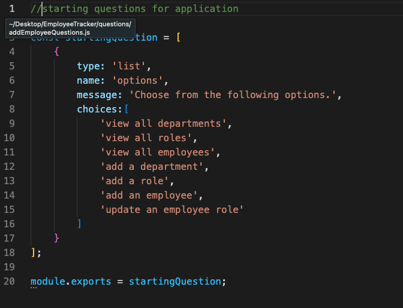
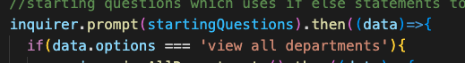
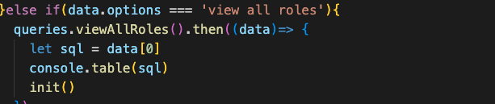
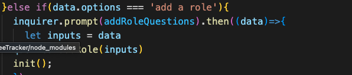
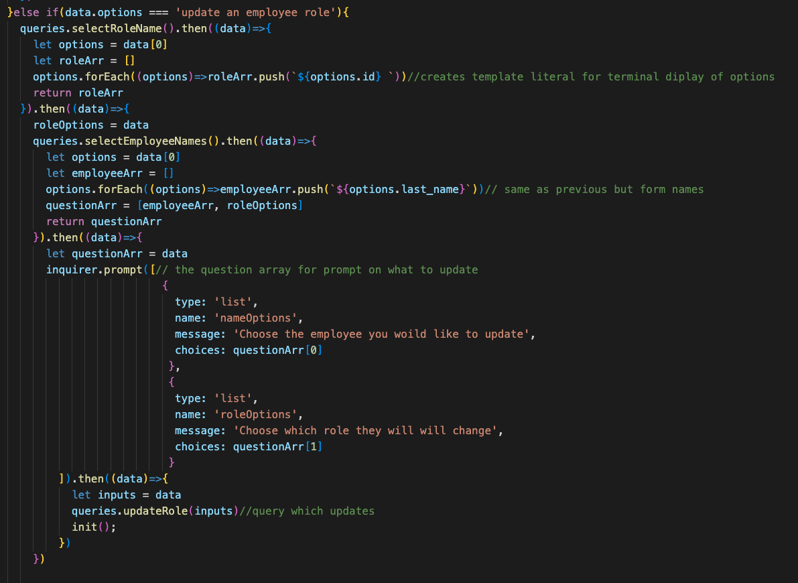

## Table of Contents
  * [License](#License)
  * [Title](#Title)
  * [Description](#Description)
  * [Installation](#Installation)
  * [Usage](#Usage)
  * [Contribution](#Contribution)
  * [Test](#Test)
  * [Technologies](#Technologies)
  * [Questions](#Questions)
  * [Spot-light](#Spot-light)
  
## License

# Employee Tracker 
### Grant Ellington
## Description
This is a set up of an SQL database which you can dynaimically munipulate data via the terminal.

## Installation

Clone repository and run node server.js

## Usage Information

See license

## Contribution 

Contcact creator with the listed in Questions.

## Test

n/a

## Technologies
Project is created with:
* javascript
* mysql
* Node.js
## Set-up

## Questions
Grant-Ellington
[gellingtonem6@gmail.com](gellingtonem6@gmail.com)

## Spot-Light
This is an example of a questions array stored in the question folder. They were exported to the server file for use.

The below starts the program when startingquestions via inquirer, and presents  the functionality through the answer with the use of if-else  statements.

Below is an example how the quriereis folder is ran when the user selects view all.

Below is the connection of mysql to the database.

Below is how you add the role to database using queries for the queries.js.

Below is the function that executes the updates.

Below are video examples of the program running.

https://user-images.githubusercontent.com/109107643/199330720-bd4ddd00-e98d-4786-8813-9f02307a397c.mov

https://user-images.githubusercontent.com/109107643/199330736-57bb1040-ac8a-4b89-9d92-789327ebb973.mov

https://user-images.githubusercontent.com/109107643/199330764-777f4629-3ee7-49d0-b881-43e38fba6a84.mov

